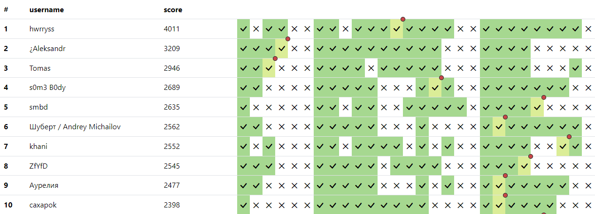
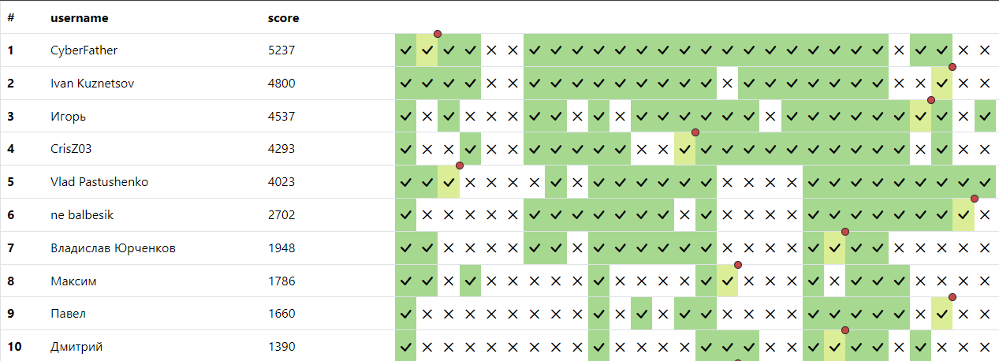

# FF101 CTF

## Сводная таблица по таскам

| Таск                         | Категория          | Автор        | Writeup                                                            | Количество Решений | First Blood                    |
| ---------------------------- | ------------------ | ------------ | ----------------------------------------------------------------- | ------------------ | ------------------------------ |
| Д0бр0 п0ж4л0в4ть в киBEERд0м | Warm-Up / Intro    | @greg0r0     | [Writeup](./tasks/warmup/sanitycheck/solution/README.md)           | 221                | Гриша Тишков                   |
| Строки I                     | Warm-Up / RE       | @greg0r0     | [Writeup](./tasks/warmup/str_1/solution/README.md)                 | 149                | zblflt,fuuth                   |
| Салат                        | Warm-Up / Crypto   | @greg0r0     | [Writeup](./tasks/warmup/salad/solution/README.md)                 | 178                | Иван                           |
| Ветка                        | Warm-Up / Forensic | @greg0r0     | [Writeup](./tasks/warmup/yatb_git/solution/README.md)              | 53                 | RRiv                           |
| Роботы                       | Warm-Up / Web      | @greg0r0     | [Writeup](./tasks/warmup/robots_warmup/solution/README.md)         | 72                 | Иван                           |
| Калькулятор                  | Warm-Up / Misc     | @greg0r0     | [Writeup](./tasks/warmup/calc/solution/README.md)                  | 161                | 013K                           |
| SimpleHashAlgorithm          | Crypto             | @anfinogenov | [Writeup](./tasks/crypto/SimpleHashAlgorithm/solution/README.md)   | 0                  | -                              |
| RRRRRRRRSA                   | Crypto             | @anfinogenov | [Writeup](./tasks/crypto/RRRRRRRRSA/solution/README.md)            | 7                  | Nikita                         |
| Салат II                     | Crypto             | @greg0r0     | [Writeup](./tasks/crypto/salad_2/solution/README.md)               | 15                 | Nikita                         |
| Ручная работа                | Crypto             | @greg0r0     | [Writeup](./tasks/crypto/malware_attack/solution/README.md)        | 18                 | RRiv                           |
| DoubleEnc                    | Crypto             | @bork_dog    | [Writeup](./tasks/crypto/DoubleEnc/solution/README.md)             | 0                  | -                              |
| Nonononod                    | Misc/Jailbreak     | @chiukki     | [Writeup](./tasks/misc/nonononod/solution/README.md)               | 20                 | ne balbesik                    |
| Cats Notes                   | Misc/Joy           | @chiukki     | [Writeup](./tasks/misc/cats_notes/solution/README.md)              | 32                 | ne balbesik                    |
| ROX                          | Misc/PPC           | @chiukki     | [Writeup](./tasks/misc/ROX/solution/README.md)                     | 15                 | Tomas                          |
| World Sudoku Championship    | Misc/PPC           | @chiukki     | [Writeup](./tasks/misc/WorldSudokuChampionship/solution/README.md) | 25                 | Max                            |
| Двойное дно                  | Forensic           | @greg0r0     | [Writeup](./tasks/forensic/double_secret/solution/README.md)       | 41                 | KO$TEN                         |
| 1001 tar                     | Forensic           | @hexadec1mal | [Writeup](./tasks/forensic/1001_tar/solution/README.md)            | 18                 | s0m3 B0dy                      |
| Deep Headers Galactic        | Web                | @greg0r0     | [Writeup](./tasks/web/deep_headers_galactic/solution/README.md)    | 17                 | Александр                      |
| pomidor                      | Web                | @anfinogenov | [Writeup](./tasks/web/pomidor/solution/README.md)                  | 2                  | Vlad Pastushenko               |
| jewel                        | Web                | @anfinogenov | [Writeup](./tasks/web/jewel/solution/README.md)                    | 20                 | ne balbesik                    |
| Snow Hell                    | Web                | @Rubikoid    | [Writeup](./tasks/web/snow_hell/solution/README.md)                | 13                 | SSH Protocol                   |
| Classic Meme Stash I         | Web                | @hexadec1mal | [Writeup](./tasks/web/classic_meme_stash_1/solution/README.md)     | 55                 | caxapok                        |
| Classic Meme Stash II        | Web                | @hexadec1mal | [Writeup](./tasks/web/classic_meme_stash_2/solution/README.md)     | 20                 | caxapok                        |
| PT Flag Installer            | RE                 | @greg0r0     | [Writeup](./tasks/rev/PTFLagInstaller/solution/README.md)          | 4                  | Игорь                          |
| Строки II                    | RE                 | @greg0r0     | [Writeup](./tasks/rev/str_2/solution/README.md)                    | 21                 | SFOB                           |
| Просто сказка                | RE                 | @pr0t0boo    | [Writeup](./tasks/rev/dream_reverse/solution/README.md)            | 18                 | Thund3rb0lt /// Astafiev Denis |
| gXcQ                         | RE                 | @pr0t0boo    | [Writeup](./tasks/rev/arduino_rev/solution/README.md)              | 4                  | CrisZ03                        |

## Топ-10 Оффлайн скорборда

## Топ-10 Онлайн Скорборда

## Благодарности

Команду [hackingweek.ru](https://hackingweek.ru) за возможность провести CTF для новичков.

Команду kks за [YATB](https://github.com/kksctf/yatb).

[@Rubikoid](https://github.com/Rubikoid) за поддержку инфраструктуры.
